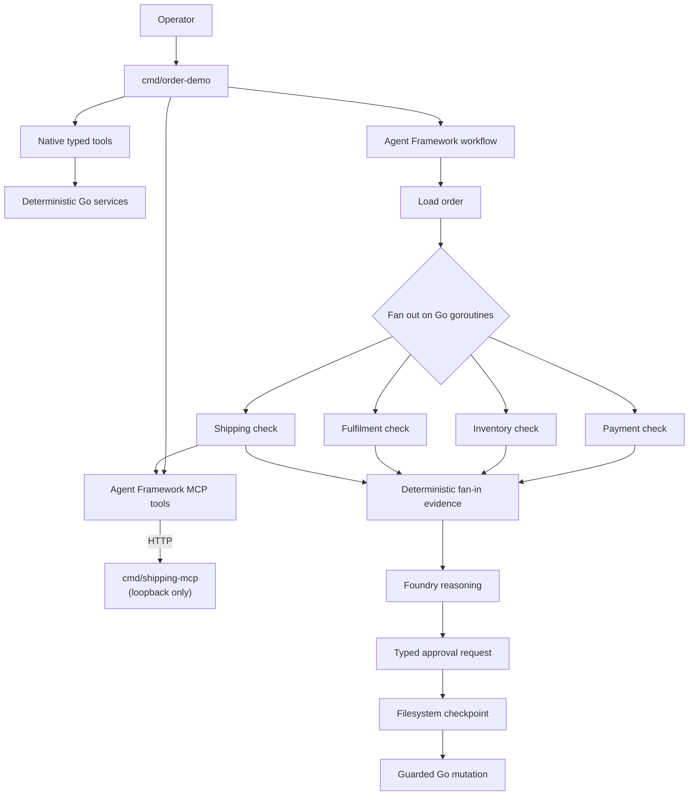

# Agentic order service

Companion sample for **From Go service to agentic application with Microsoft
Agent Framework**. It evolves one deterministic order-fulfilment service through
typed tools, a Foundry-backed agent, MCP, a concurrent workflow, human approval,
durable resume, and OpenTelemetry.

The sample is intentionally small and local-first:

- order `58372` is awaiting fulfilment in Melbourne;
- payment `PAY-58372` is captured;
- Melbourne has `0` units of `SKU-441`;
- Sydney has `14` units;
- no shipment exists yet;
- Sydney adds one day and AUD 8.40 to delivery.

It **never inspects a real Azure subscription or production system**. Live agent
commands authenticate only to the Foundry project endpoint you explicitly place
in `FOUNDRY_PROJECT_ENDPOINT`. Domain data, shipping data, checkpoints, and
mutations are local demo implementations.

## Architecture



`AddFanOutEdge` expresses independent work. The Agent Framework in-process
runner dispatches each activated receiver concurrently using Go goroutines and
an `errgroup`; `AddFanInBarrierEdge` waits for all four branches before the
sample assembles evidence in a stable order. The sample uses `inproc.Default`
because it runs one workflow at a time. `inproc.Concurrent` controls concurrent
*workflow runs*, not concurrency between branches of one run.

## Requirements and pinned preview revision

- Go **1.26 or later**
- Azure credentials supported by
  [`DefaultAzureCredential`](https://pkg.go.dev/github.com/Azure/azure-sdk-for-go/sdk/azidentity#DefaultAzureCredential)
  for live Foundry commands
- A Foundry project endpoint and model deployment

Microsoft Agent Framework for Go is in preview and currently has no tagged
release. `go.mod` pins:

```text
github.com/microsoft/agent-framework-go
v0.0.0-20260826101001-8c8544a5a1db
```

That pseudo-version is commit
[`8c8544a5a1db5b3376420e75ec8b81d8cef04744`](https://github.com/microsoft/agent-framework-go/commit/8c8544a5a1db5b3376420e75ec8b81d8cef04744),
whose module requires Go 1.26 and MCP Go SDK v1.7.0. Review the SDK source,
examples, and change history before upgrading.

## Offline walkthrough

No Azure credentials or external network are needed after dependencies have
been downloaded.

```bash
go run ./cmd/order-demo domain
go test ./...
go vet ./...
```

The domain command prints the typed local records. Tests cover:

- deterministic services, cancellation, validation, authorization, stale
  proposals, and idempotency;
- generated function-tool schemas and explicit errors;
- a real MCP client/server exchange over an `httptest` loopback server;
- overlapping workflow fan-out branches and deterministic evidence assembly;
- request-port rejection and approval;
- filesystem checkpoint close, reopen, pending-request replay, and resume;
- streamed local Responses history containing encrypted reasoning, a function
  call, and its result without replaying plaintext reasoning.

## Live setup

Set the Foundry values used by the project Responses API:

```bash
export FOUNDRY_PROJECT_ENDPOINT="https://<resource>.services.ai.azure.com/api/projects/<project>"
export FOUNDRY_MODEL="<model-deployment-name>"
```

Authenticate with any `DefaultAzureCredential` source available in your
environment. For local development, Azure CLI authentication is one option:

```bash
az login
```

The code does not enumerate resources or choose a subscription. It requests a
token and calls only the configured project endpoint.

Start the controlled shipping server in terminal 1:

```bash
go run ./cmd/shipping-mcp --listen 127.0.0.1:8081
```

The server rejects non-loopback bind addresses.

## Progressive commands

### 1. Ordinary Go service

```bash
go run ./cmd/order-demo domain
```

Expected facts include:

```text
status: awaiting_fulfilment
payment: captured
MEL available: 0
SYD available: 14
fulfilment: blocked_waiting_for_stock
```

### 2. One agent and one native tool

`basic` exposes only `get_order`. Multiple positional prompts reuse one local
Agent Framework session. Responses are streamed to the terminal.

```bash
go run ./cmd/order-demo basic \
  "Why hasn't order 58372 shipped?" \
  "What did you learn from the order record?"
```

The first stage should acknowledge that the order record alone cannot prove the
cause. The agent is configured with `DisableStoreOutput: true`; the local
session owns complete conversational and tool-call history.

### 3. Add application tools and shipping MCP

With the shipping server still running:

```bash
go run ./cmd/order-demo agent \
  --shipping-endpoint http://127.0.0.1:8081 \
  "Why hasn't order 58372 shipped, and what can we do about it?" \
  "Did the customer already pay?"
```

The agent receives these native read-only function tools:

```text
get_order
get_payment_status
get_inventory
get_fulfilment_status
```

It discovers these tools over MCP rather than registering shipping functions
directly:

```text
get_shipping_status
estimate_delivery
```

Expected reasoning is that payment is captured, Melbourne is out of stock,
Sydney has stock, and shipping from Sydney adds one day.

### 4. Deterministic concurrent investigation

```bash
go run ./cmd/order-demo workflow \
  --shipping-endpoint http://127.0.0.1:8081 \
  --order 58372
```

Progress lines make the goroutine-backed branches visible:

```text
[workflow] goroutine branch started: CheckPayment
[workflow] goroutine branch started: CheckInventory
[workflow] goroutine branch started: CheckFulfilment
[workflow] goroutine branch started: CheckShipping
...
```

Ordering can vary because those checks are concurrent. The final JSON evidence
is deterministic and is handed to a separate structured-output Foundry
reasoner. A transfer proposal is accepted only when every field exactly matches
the assembled evidence.

### 5. Start and pause for approval

```bash
go run ./cmd/order-demo resolve \
  --shipping-endpoint http://127.0.0.1:8081 \
  --order 58372 \
  --state .order-demo/58372
```

The workflow imperatively posts a typed request described by a `RequestPort`.
The process waits until the superstep containing that pending request has a
durable filesystem checkpoint, writes `.order-demo/58372/run.json`, closes the
run and checkpoint store, prints exact resume commands, and exits. No mutation
has run.

Example impact:

```text
fromWarehouse: MEL
toWarehouse: SYD
additionalDays: 1
additionalCostCents: 840
currency: AUD
```

### 6. Resume in a later process

Approve:

```bash
go run ./cmd/order-demo resume \
  --state .order-demo/58372 \
  --approve \
  --actor operator@example.com \
  --permission order.fulfilment.transfer
```

Reject:

```bash
go run ./cmd/order-demo resume \
  --state .order-demo/58372 \
  --reject \
  --actor operator@example.com
```

Resume does not require Foundry or the MCP server. The checkpoint already
contains the completed investigation and pending request. Agent Framework
replays the same request ID, the CLI binds the human decision to the exact
proposal digest, and only then can the Go mutation run.

The mutation independently verifies:

- the decision is approved;
- the actor has `order.fulfilment.transfer`;
- approval matches the exact proposal;
- order version, state, warehouse, items, and payment are still valid;
- target inventory is sufficient;
- the idempotency key has not been used for another command.

Repeating a completed resume returns the saved result without running the
mutation again.

## Opt-in OpenTelemetry

Telemetry is off by default. Enable a pretty-printed stdout exporter:

```bash
export ORDER_DEMO_TELEMETRY="stdout"
go run ./cmd/order-demo workflow --shipping-endpoint http://127.0.0.1:8081
```

Agent middleware emits agent and tool spans. Workflow telemetry emits workflow
and executor spans. `EnableSensitiveData` remains `false`, so prompts, model
responses, tool arguments/results, domain records, and approval payloads are
not added to workflow span attributes by this sample.

## Trust boundaries

| Boundary | Sample control | Production consideration |
|---|---|---|
| Foundry | Explicit endpoint/model and `DefaultAzureCredential` | Identity, model deployment, data handling, quotas |
| Native tools | Typed, narrow, read-only adapters | Backend authorization, rate limits, result bounds |
| Shipping MCP | Loopback-only deterministic server | Server identity, authentication, tool changes, egress, availability |
| Agent output | Structured schema plus evidence validation | Evaluation, prompt changes, model upgrades |
| Approval | Typed request/response bound to proposal digest | Durable identity, roles, audit retention, separation of duties |
| Mutation | State, payment, stock, authorization, idempotency checks | Transactional database and durable idempotency ledger |
| Checkpoints | Process-exclusive local JSON store | Managed durable store, encryption, concurrency, retention |
| Telemetry | Opt-in stdout, sensitive workflow data disabled | Export policy, redaction, access control, retention |

## Preview caveats

- The deterministic in-memory order service resets for each CLI process. The
  checkpoint and completion manifest make this demo's approval lifecycle
  durable, but they are not a transactional order database.
- The filesystem checkpoint store is process-exclusive and not goroutine-safe.
  One CLI process opens it for one run and closes it before another process
  resumes.
- The approval executor uses Agent Framework's low-level
  `NewExternalRequest`/`PostRequest` API rather than `RequestPort.Bind`. At the
  pinned preview revision, the convenience binding's internal wrapped-request
  map does not restore correctly from JSON in a new process. The low-level API
  keeps the same framework-native request/response and checkpoint semantics.
- The local shipping MCP server is an interoperability demonstration, not a
  carrier integration.
- The model proposes an action, but the workflow rejects proposals that do not
  exactly match typed evidence. Approval is an additional control, not a
  substitute for mutation validation.
- The pinned SDK includes the streamed Responses fix that preserves encrypted
  reasoning and tool-call history when `DisableStoreOutput` is enabled. The
  regression test protects the sample's use of that path.

## Repository layout

```text
cmd/order-demo          staged CLI
cmd/shipping-mcp        controlled MCP server
internal/orderdomain    models and service contracts
internal/orderdata      deterministic services and mutation
internal/ordertool      native Agent Framework function tools
internal/shippingmcp    typed MCP server and client
internal/orderagent     Foundry session, streaming, structured reasoning
internal/investigation  fan-out/fan-in and approval workflows
internal/resolution     filesystem checkpoint start/resume
internal/telemetry      opt-in OpenTelemetry wiring
```

## License

[MIT](LICENSE)
